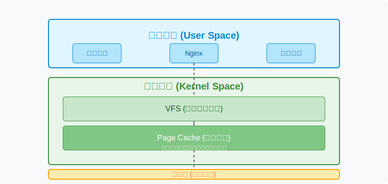
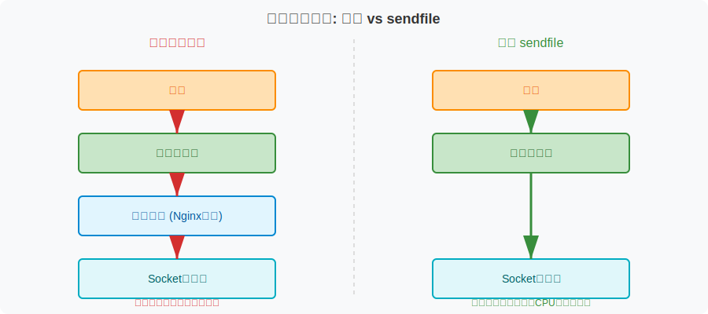
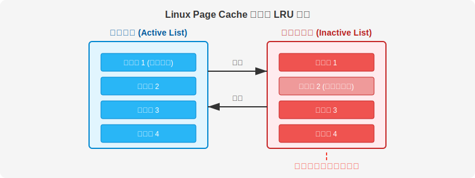

+++
date = '2025-04-18T14:26:53+08:00'
draft = false
title = 'Nginx/Openresty 不仅仅可以缓存到磁盘，还可以利用 linux cache page 进行内存缓存'
tags = ["nginx", "linux", "cache", "memory cache", "linux cache page", "nginx cache", "openresty cache"]
categories = ["linux", "nginx"]
description = "nginx/openresty 下的内存缓存 与 linux cache page"
slug = "nginx-openresty-cache-linux-cache-page"
image = "nginx-1024x344.webp"
toc = true
+++


## 简介

Nginx 虽然没有提供将文件直接缓存到内存中的能力，但在实际运行过程中，内存确实在缓存中发挥了重要作用。经过调研和排查，我们证实了磁盘中的缓存文件被 Linux 的 buffer/page cache 缓存了。

> **关键信息**：在 Nginx 中，默认情况下就会利用操作系统的 Page Cache（通过内核的文件缓存机制），无需特殊配置即可自动缓存频繁访问的静态文件。

---

## Linux Page Cache 原理

Linux Page Cache 最初是 Buffer/Page Cache，后来迭代为统一的 Page Cache。下图展示了 Page Cache 在系统架构中的位置：



> **架构说明**：Page Cache 完全位于内核层中，与 VFS（Virtual Filesystem，虚拟文件系统）处于同一抽象层。它属于内核空间，不属于用户空间。

---

## Nginx 中的核心配置

要充分利用 Linux Page Cache，Nginx 中有三个核心配置选项：

### sendfile

传统文件传输路径：
> 磁盘 → 内核缓冲区 → 用户空间 → Socket 缓冲区 → 网络

存在多次数据拷贝操作。

启用 sendfile 后：
> 磁盘 → 内核缓冲区 → Socket 缓冲区 → 网络

跳过用户空间拷贝，显著减少 CPU 和内存开销。



> **优化提示**：sendfile 通常与 tcp_nopush 搭配使用，填充数据包再发送，进一步提高传输效率。

### aio (异步 I/O)

通过内核异步 I/O 或线程池（Linux）非阻塞处理文件，避免 Worker 进程阻塞。

### directio

绕过内核缓存直接读写磁盘（需配置 directio 指令），特别适合大文件处理。

---

### 最佳实践

通过在 Nginx 上搭配使用以上三个核心配置，可以实现：
- **小文件/热文件**：从内核缓存区直接读取（page cache 位于内核缓冲区）
- **大文件**：直接从磁盘读取，防止文件过大带来的额外内存挤占

---

## 示例配置

```nginx
http {
    sendfile on;       
    tcp_nopush on;

    directio 4m;    # 仅对超过 4MB 的文件启用 DirectIO（绕过 Page Cache）
    aio on;         # 异步读取（可选，Linux 下依赖线程池）
}
```

## 验证工具：vmtouch

vmtouch 是一个可以查看内存缓存情况的实用工具。

> **安装方法**：

```bash
# 克隆仓库
git clone https://github.com/hoytech/vmtouch.git

# 执行编译安装
cd vmtouch && make && make install

# 查看缓存的具体文件
vmtouch -v /var/auth-cdn/cache
```

### 实测效果

从下面这张截图可以看出（`/var/auth-cdn/cache` 为节点的缓存目录）：


### 缓存统计结果
- **磁盘缓存目录**：2个文件，7个条目（包括目录）
- **Page Cache 缓存**：84页内存（1页 = 4KB）
- **内存缓存总大小**：336KB
- **内存缓存率**：100%

**测试数据说明**：
这个数据来自测试环境，在 Nginx 上只配置了缓存这两个文件，所以缓存率能达到100%。

**生产环境数据**：
- 缓存文件数量：约71万个
- 总大小：约600GB
- 内存缓存：约100GB+
- 缓存率：约15%（根据内存大小而定）

> **更多验证方法**：更多排查命令，如 `top`，`free`，`cat /proc/meminfo` 等都能印证磁盘缓存中的部分文件被缓存进了 Page Cache 中。

---

## Page Cache 淘汰策略

Linux 的 Page Cache 使用改良版的 LRU 算法作为淘汰算法，不同于传统意义上的 LRU，其中加入了一些优化。



系统维护两个列表（Two-List LRU）：
- 一个"**热表**"（Active List）
- 一个"**冷表**"（Inactive List）

淘汰策略是优先淘汰"冷表"中的数据。

> **更多资料**：更多详细介绍可参考：[Linux Memory Management](https://www.kernel.org/doc/gorman/html/understand/understand013.html)